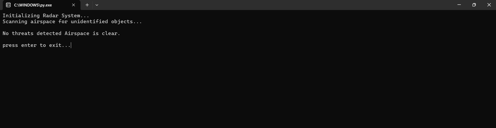
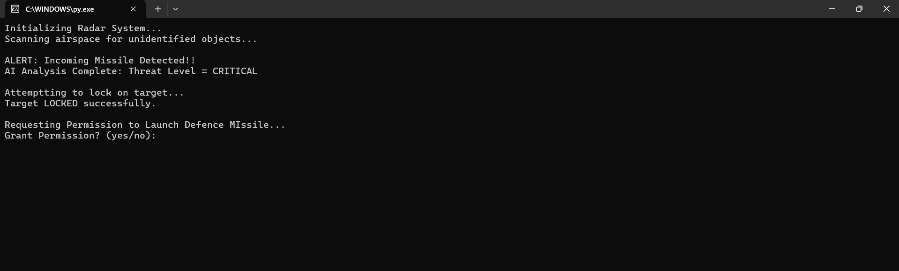
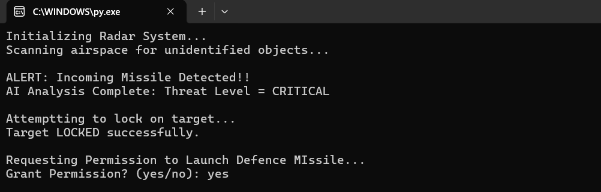
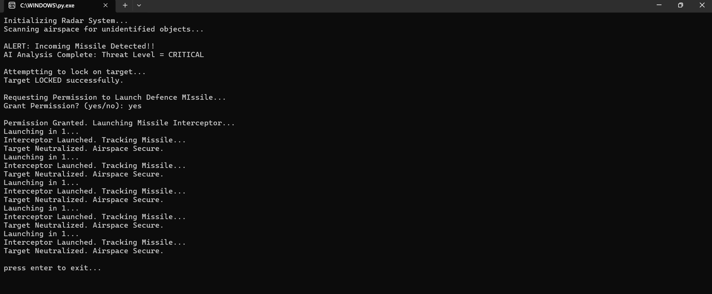
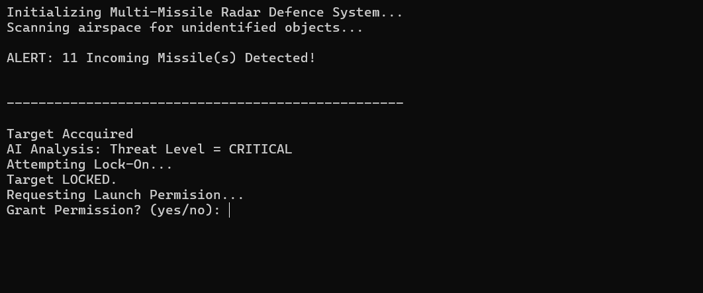
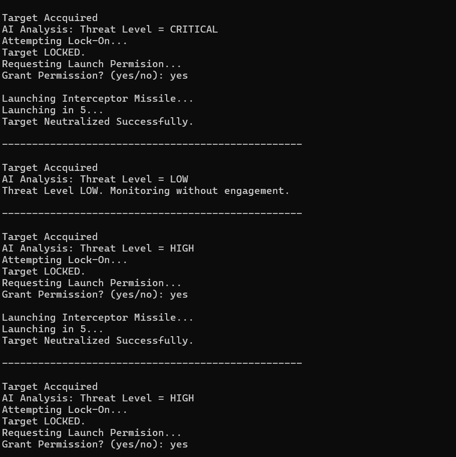
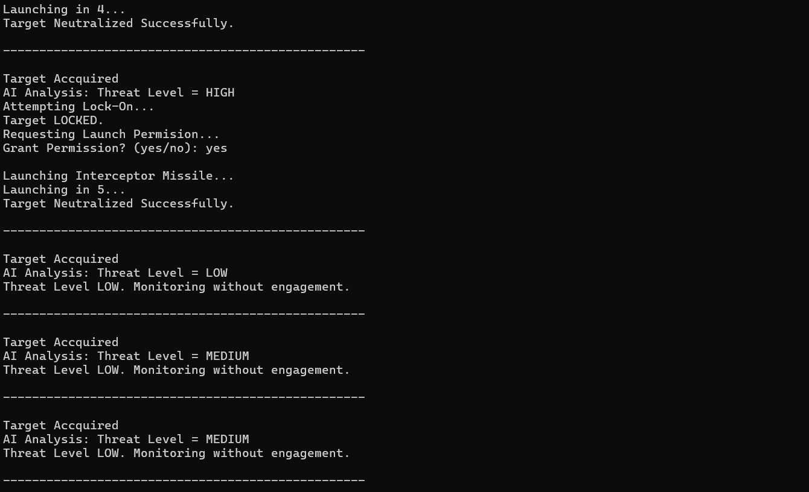
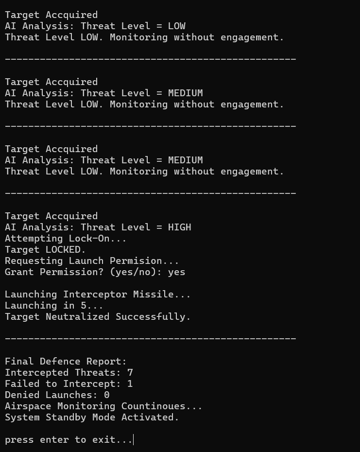

# ASTRA AIR SHIELDING THREAT RESPONSE ALGORITHM

A beginner-level Python project that simulates an Air Shielding and Threat Response System.

## Features

- Threat detection
- Threat analysis
- Simulated response system
- Beginner-friendly Python code

## Language Used

- Python

## Author

Shaurya Shikher Gupta

## Version

14.7.1

## Version History

### Version 1
- Initial release

### Version 2
- Improved threat analysis

### Version 3
- Added authentication system

#### Version 3.5
- Improved authentication system and threat analysis

## Screenshots - Version 1

### Initial Screen

### System Authentication

### Giving Clearance

### Final Output

## Screenshots - Version 2

# Threat Analysis

## Target Analysis

### Target Analysis 2

#### Final Report of Engagement
